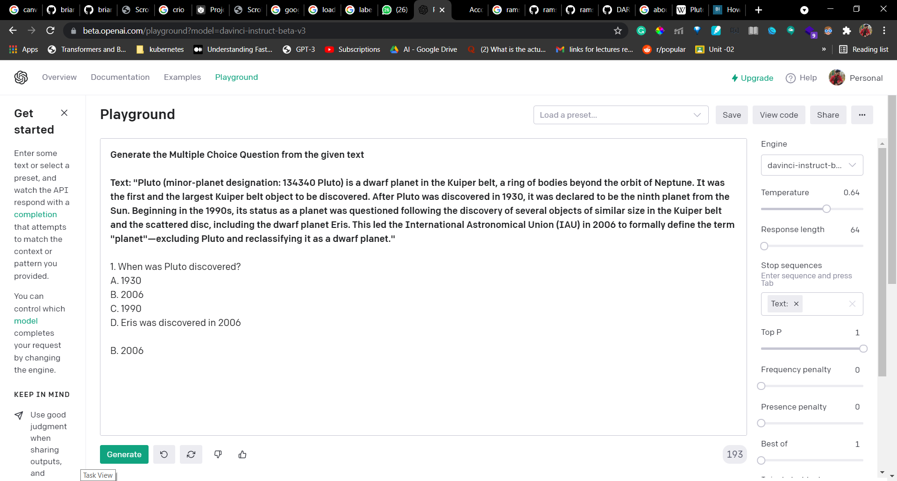

# High-Quality-MCQ-Generator-Using-GPT-3

Builded a High Quality MCQ Generator Using GPT-3, the project is amided at solving the day to day task of the school, college teachers & profs in creating of MCQ's from a sample of text.I have came up with a very simple solution on utilizing GPT-3(Generative Pretrained Transformers) to solve this use case.

The Project is in very intial stage, and require a lot of things to be done.So, don't forgot to star and help it to grow it :)

**Note:** ***This Project require Openai GPT-3 License Key, you can get it from [Openai](https://beta.openai.com/)***

## GPT-3 Playground

  

